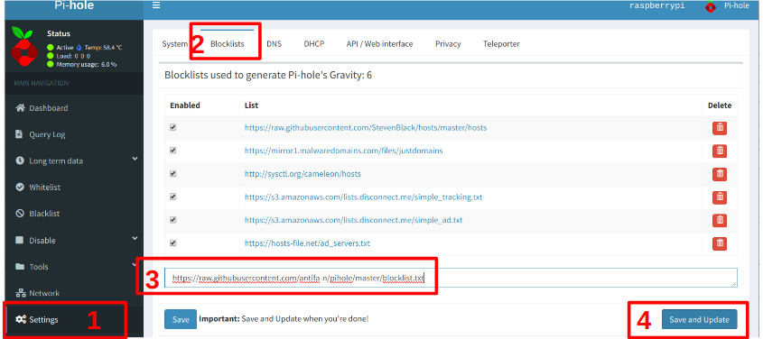

# Pi-hole blocklists
Here you will find Pi-hole (https://pi-hole.net) blocklists for nazi, fascist, alt-right, anti-LGBT, white nationalistic, supremacy and right-wing populistic websites.

Do you have children or manage a school or a company and want to ensure no one in your network accesses such content? Here are the blocklists for you.

***In total, +5000 domains listed.***

In some rare cases, sites which hosts offensive content as well as other things are included, such as 4chan, 8chan and gab.

If you want to block all well known 
where nazis, facists, alt-right, anti-LGBT and white nationalistic groups organizes, there is a specific alt-tech blocklist which blocks known platforms listed here: https://en.wikipedia.org/wiki/Alt-tech (but excluding, Discover, Telegram and Signal).

***Please note that regular conservative sites are not blocked***

# Using the blocklists
0. Follow below instructions, as also depicted on below graphics.
1. Go to your pi-hole admin interface
2. Click on Settings
3. Click the tab Blocklists
4. Choose a blocklist.
* To only block nazi, fascist, alt-right, anti-LGBT, white nationalistic and supremacy content, enter in this url: https://raw.githubusercontent.com/antifa-n/pihole/master/blocklist.txt
* To block right-wing populistic content, also add this list: https://raw.githubusercontent.com/antifa-n/pihole/master/blocklist-pop.txt
* To block alt-tech platforms that hosts nazi, fascist, alt-right, white nationalists, anti-LGBT content, enter this url: https://raw.githubusercontent.com/antifa-n/pihole/master/blocklist-alttech.txt
5. Click Save and Update
6. Don't forget to update gravity on a regular basis

# Contributions
Feel free to create a pull request.

# Sources
* https://en.wikipedia.org/wiki/List_of_white_nationalist_organizations
* https://en.wikipedia.org/wiki/White_nationalism
* http://www.sjsu.edu/faculty/Brent/190/hatelinks.html
* https://www.counterextremism.com/content/us-white-supremacy-groups
* https://en.wikipedia.org/wiki/List_of_organizations_designated_by_the_Southern_Poverty_Law_Center_as_hate_groups
* https://arxiv.org/pdf/1905.02712.pdf
* https://web.archive.org/web/20181021194007/https://dailystormer.name/a-normies-guide-to-the-Alt-Right/
* http://gatesofvienna.blogspot.com linklist
* https://www.adl.org/
* https://en.wikipedia.org/wiki/Category:Neo-Nazi_websites
* https://en.wikipedia.org/wiki/Category:Holocaust_denying_websites
* Iron march reviewed link lists

# Sources for right-wing populistic content
* https://en.wikipedia.org/wiki/Right-wing_populism

# Sources for alt-tech content:
https://en.wikipedia.org/wiki/Alt-tech
